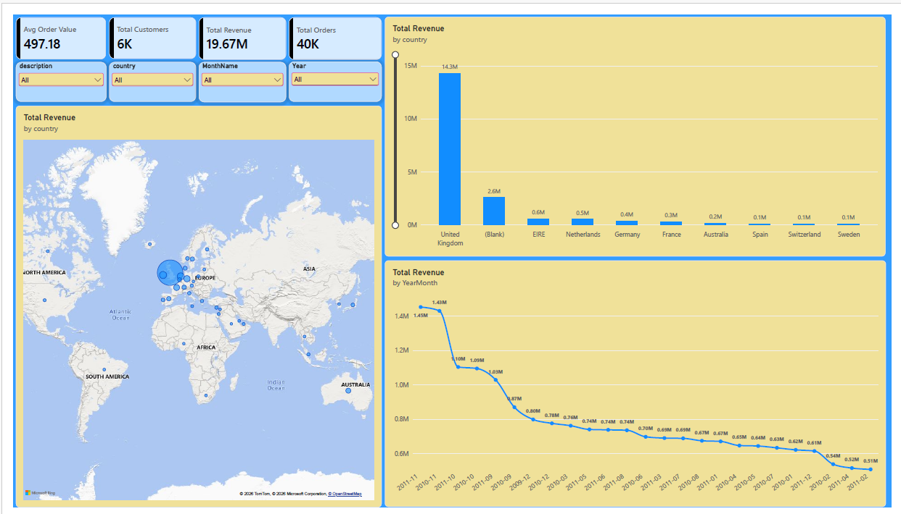
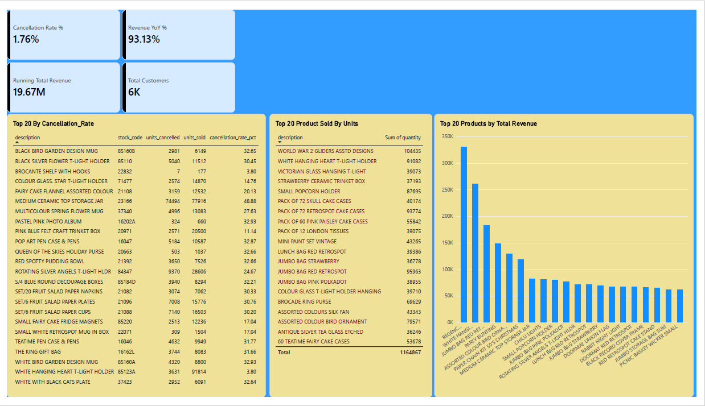
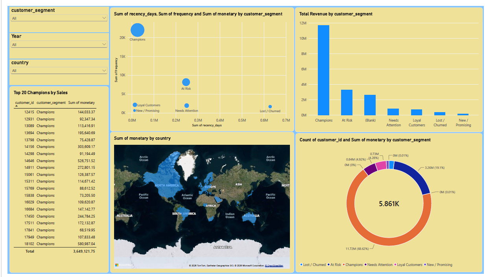
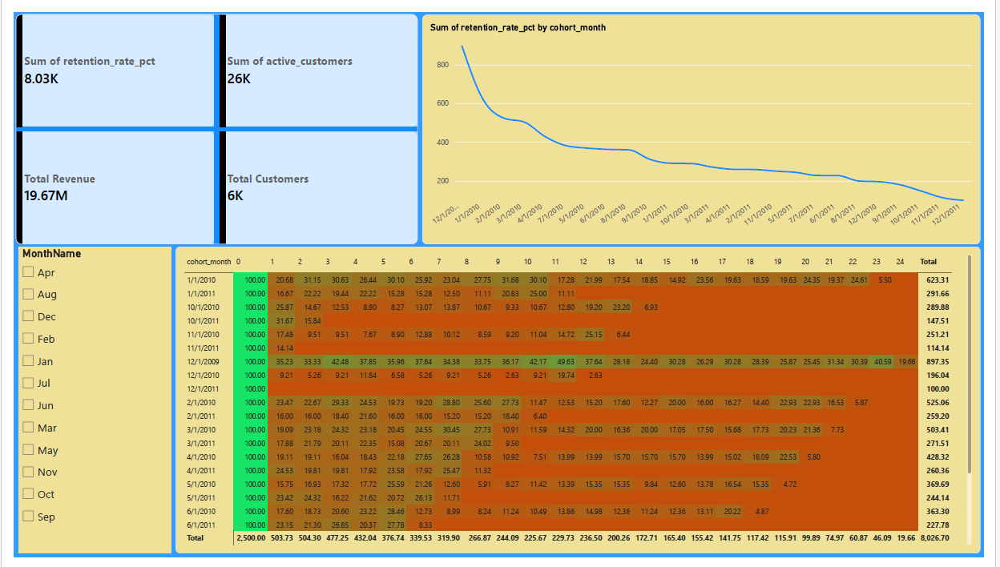
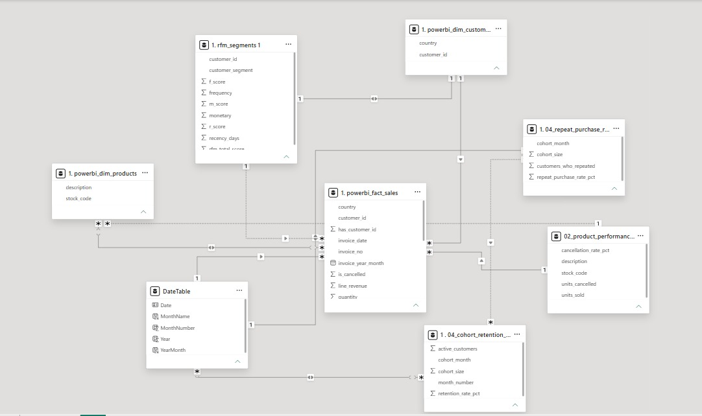

# Online Retail II — Sales & Customer Analytics

End-to-end data analytics project on the **Online Retail II** dataset (UK-based online retailer, Dec 2009 – Dec 2011). Raw transaction data is cleaned with Python, modeled and queried with SQL, and visualized in an interactive Power BI dashboard — covering revenue trends, country performance, product analysis, customer segmentation (RFM), and cohort retention.

---

## 🧰 Tech Stack

| Stage | Tool |
|---|---|
| Data cleaning | Python (pandas) |
| Data modeling & querying | SQL (SQLite) |
| Dashboard / visualization | Power BI |
| Reporting | Excel (formula-driven KPI summary) |

---

## 📁 Project Structure

```
Online Retail Shop/
├── data/
│   ├── online_retail_II.xlsx          # Raw source data
│   ├── cleaned_retail_data.csv        # Cleaned output (Python)
│   ├── online_retail.db               # SQLite database (star schema)
│   ├── removed_rows_summary.csv       # Data cleaning log
│   ├── powerbi_fact_sales.csv         # Power BI fact table
│   ├── powerbi_dim_customers.csv      # Power BI dimension table
│   └── powerbi_dim_products.csv       # Power BI dimension table
├── scripts/
│   ├── 01_clean_data.py               # Cleaning & transformation
│   ├── 02_load_to_sqlite.py           # Loads cleaned data into SQLite
│   └── 03_build_kpi_excel.py          # Builds KPI_Summary.xlsx
├── sql/
│   ├── 00_schema.sql                  # Star-schema table definitions
│   ├── 01_revenue_and_country.sql     # Revenue trend & country analysis
│   ├── 02_top_products.sql            # Top products, cancellations
│   ├── 03_rfm_and_segmentation.sql    # RFM scoring & customer segments
│   └── 04_cohort_retention.sql        # Cohort retention analysis
├── powerbi/
│   ├── Online_Retail.pbix
│   └── PowerBI_Build_Guide.md
├── report/
│   ├── KPI_Summary.xlsx
│   └── Insights_and_Recommendations.md
├── assets/
│   └── screenshots/                   # Dashboard page screenshots
├── .gitignore
└── README.md
```

> **Note:** Large files (`online_retail.db`, `cleaned_retail_data.csv`, `powerbi_fact_sales.csv`) are excluded from this repo via `.gitignore` due to GitHub's file size limits. See the [Reproducing this project](#-reproducing-this-project) section to regenerate them locally.

---

## 📊 Dataset

- **Source:** [Online Retail II](https://archive.ics.uci.edu/dataset/502/online+retail+ii) — UCI Machine Learning Repository
- **Scope after cleaning:** 1,021,403 transaction lines · 5,894 identified customers · 4,918 products · 43 countries
- **Time period:** December 2009 – December 2011

---

## 🔑 Key Insights

| Metric | Value |
|---|---|
| Total revenue (net of cancellations) | £19,666,308.83 |
| Total orders | 39,556 |
| Average order value | £497.18 |
| Order-line cancellation rate | 1.76% |

- **United Kingdom dominates** the business — 85.5% of revenue and 91.5% of orders. EIRE and the Netherlands are the top international markets, both showing wholesale-like buying patterns (few customers, high average order value).
- **"REGENCY CAKESTAND 3 TIER"** is the single highest-revenue product (~£330K); **"WHITE HANGING HEART T-LIGHT HOLDER"** and **"JUMBO BAG RED RETROSPOT"** are top sellers by both revenue and volume.
- **RFM segmentation reveals a classic Pareto pattern**: the "Champions" segment is just 22.7% of customers but generates 68.6% of total revenue — customer retention in this segment matters far more than acquiring new low-value customers.
- **Cohort retention** shows month-1 repeat-purchase rates averaging ~21% (range 9–35% across cohorts) — most drop-off happens right after the first purchase, making a "second purchase" nudge campaign (20–40 days post-first-order) a high-leverage opportunity.

📄 Full write-up with all recommendations: [`report/Insights_and_Recommendations.md`](report/Insights_and_Recommendations.md)

---

## 📈 Dashboard Preview

### Executive Overview


### Product Performance


### Customer Segmentation (RFM)


### Cohort & Retention Analysis


### Data Model


*(Full interactive `.pbix` file is in the [`powerbi/`](powerbi/) folder — open in Power BI Desktop to explore.)*

---

## 🔍 Analysis Highlights

**SQL** ([`sql/`](sql/)) — window functions (`LAG`, `NTILE`, `RANK`), CTEs, and self-joins used for:
- Month-over-month revenue growth
- RFM scoring and customer segmentation
- Cohort-based retention matrix (the classic "cohort triangle")

**Python** ([`scripts/`](scripts/)) — pandas-based cleaning: duplicate removal, null handling, cancellation flagging, and export to both a SQLite database and Power BI-ready CSVs.

**Power BI** ([`powerbi/`](powerbi/)) — DAX measures for time intelligence (MoM %, YoY %), a star-schema data model, and 4 report pages. Build process documented in [`PowerBI_Build_Guide.md`](powerbi/PowerBI_Build_Guide.md).

---

## 🔁 Reproducing This Project

```bash
# 1. Clean the raw data
python scripts/01_clean_data.py

# 2. Load into SQLite
python scripts/02_load_to_sqlite.py

# 3. Build the KPI Excel summary
python scripts/03_build_kpi_excel.py

# 4. Run SQL queries against the database
sqlite3 data/online_retail.db
sqlite> .read sql/01_revenue_and_country.sql
```

For the Power BI dashboard, follow [`powerbi/PowerBI_Build_Guide.md`](powerbi/PowerBI_Build_Guide.md).

---

## 👤 Author

**Mohammad Mubin Mohammad Raees** · [LinkedIn](https://www.linkedin.com/in/mubin-bagwan-4131a6347)